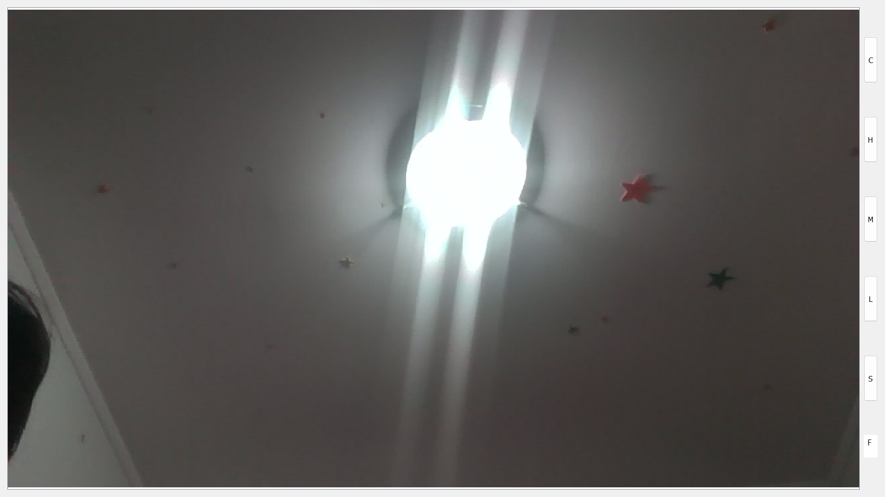
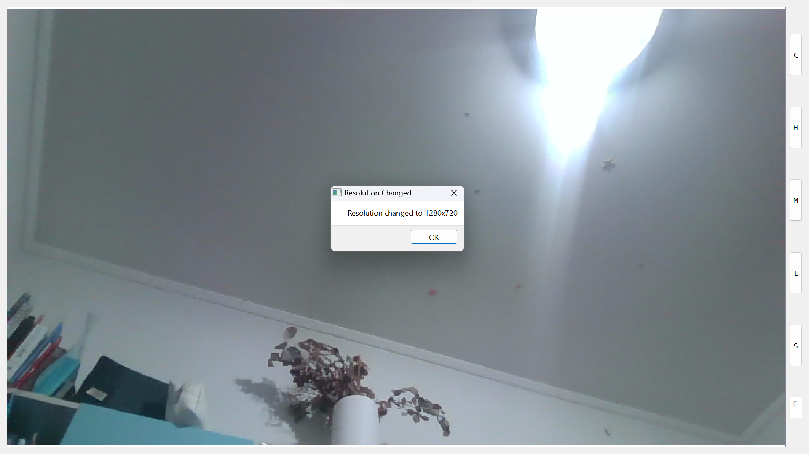

# Camera Application Documentation

## 1. Introduction

This application serves as a powerful tool for capturing and manipulating images. The user interface includes a variety of buttons and menu options that allow you to adjust the camera's resolution, switch between different cameras, and more.

## 2. Getting Started

### Running the Application

- Navigate to the folder where the application is stored.
- Locate the folder named `release`.
- Locate the executable file named `runCamera.exe`.
- Double-click `runCamera.exe` to run the application.
- 
## 3. Zoom and Camera Movement

### Zoom Functionality

- **Single Click:**
  - **Functionality:** Zooms in.
  - **Usage:** Click once on the camera feed to zoom in. This provides a closer view of the area where you clicked.

- **Double Click:**
  - **Functionality:** Zooms out.
  - **Usage:** Double-click anywhere on the camera feed to zoom out. This action restores the camera to its original zoom level.

### Camera Movement

- **Dragging (When Zoomed In):**
  - **Functionality:** Moves the camera view.
  - **Usage:** When zoomed in, click and drag to move around within the zoomed area. This allows you to explore different parts of the zoomed-in image without needing to zoom out and in again.

### Single Click

## 4. UI Components

### Buttons

- **C Button:**
  - **Functionality:** Capture a picture.
  - **Usage:** Click this button to capture the current image displayed on the camera feed.

- **H Button:**
  - **Functionality:** Change to the highest resolution.
  - **Usage:** Click this button to set the camera resolution to its maximum available setting.

- **M Button:**
  - **Functionality:** Change to half of the maximum resolution.
  - **Usage:** Click this button to set the camera resolution to half of its maximum setting.

- **L Button:**
  - **Functionality:** Change to 1/8 of the maximum resolution.
  - **Usage:** Click this button to set the camera resolution to 1/8 of its maximum setting.

- **S Button:**
  - **Functionality:** Switch between available cameras.
  - **Usage:** Click this button to toggle between different camera feeds (if multiple cameras are available).

## 5. Menu Options

### F Menu

- **IP Address:**
  - **Functionality:** Shows the user's current IP address.
  - **Usage:** Select this option to view your current IP address.

- **Image Settings:**
  - **Functionality:** Allows specification of a specific camera resolution.
  - **Usage:** Select this option to manually set the camera resolution.

- **Show Image:**
  - **Functionality:** Display a captured image.
  - **Usage:** Select this option to view a captured image on the screen.

- **Clear Image:**
  - **Functionality:** Removes the currently displayed image.
  - **Usage:** Select this option to remove the image currently displayed on the screen.

- **Restart:**
  - **Functionality:** Restarts the application.
  - **Usage:** Select this option to restart the application and initialize all settings to their default values.

- **Close:**
  - **Functionality:** Closes the application.
  - **Usage:** Select this option to close the application and exit.

## 6. Screenshots:
Here are some screenshots demonstrating the platform's interface:

